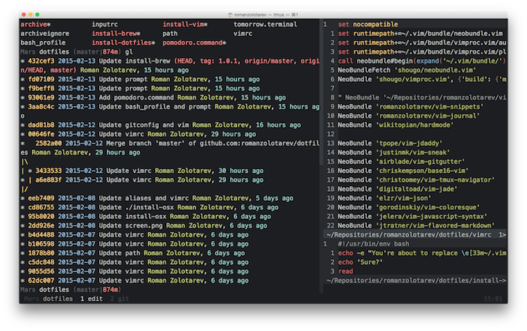

# Roman’s dotfiles

Dotfiles and scripts for tools I use every day as a programmer.

[Fork this repo](https://github.com/romanzolotarev/dotfiles/fork),
then clone, customize, and run scripts for each tool manually.

## Thanks To…

- [Sam Stephenson](http://sstephenson.us/posts/on-configuration)
- [Yan Pritzker](http://skwp.github.io/dotfiles/)
- [Mathias Bynens](https://github.com/mathiasbynens/dotfiles)
- [Edward Shaw](https://github.com/ntkme)
- [Chris Hunt](https://github.com/chrishunt/dot-files)
- [Slava Kim](https://github.com/slava/vimrc)
- [dotfiles.github.com](http://dotfiles.github.io/)

[MIT](LICENSE.md).
Copyright [Roman Zolotarev](https://www.romanzolotarev.com/).
